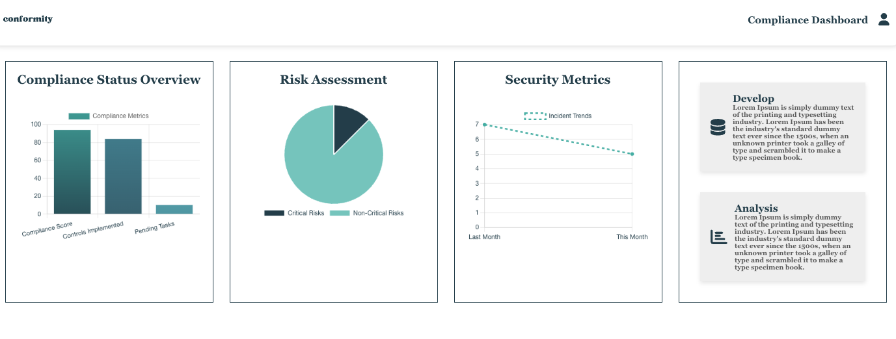
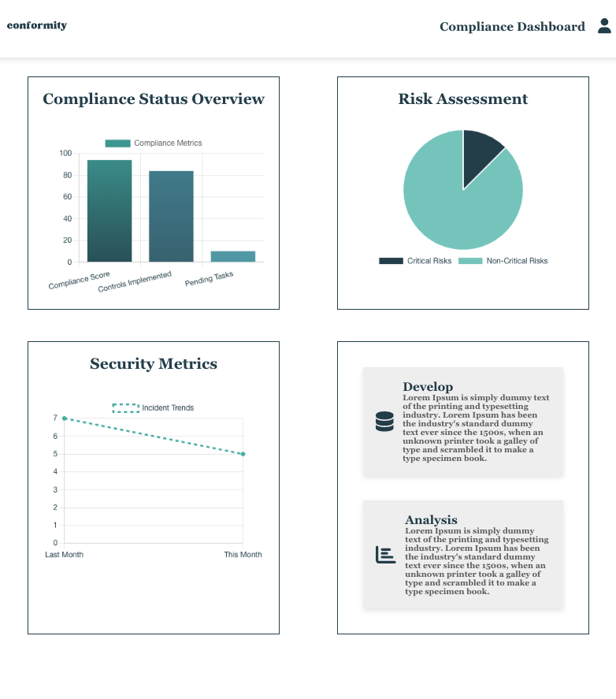

# Compliance Dashboard

This project is a compliance dashboard built using **React.js** and **Chart.js** for the frontend and **Node.js** with **Express.js** for the backend. It visualizes compliance metrics, risk assessments, and security data in an intuitive and interactive format. 

## Features

- **Interactive Charts**: Displays compliance metrics in a bar chart format with hover effects for better user interaction.
- **Dynamic Data**: The data for the chart and metrics is fetched dynamically from a backend API, which provides mock compliance data.
- **Toggle Metrics**: Users can show or update the compliance metrics with a button click.
- **Responsive Design**: The dashboard is fully responsive and adjusts to various screen sizes.
- **Accessibility**: ARIA labels have been added to make the dashboard more accessible.

## Setup Instructions

### Prerequisites

Before you begin, ensure you have the following installed:

- **Node.js**: [Download and install Node.js](https://nodejs.org/)
- **Yarn** or **npm**: [Yarn](https://classic.yarnpkg.com/lang/en/docs/install/) or [npm](https://www.npmjs.com/get-npm) for package management.

### Backend (Node.js/Express)

1. Clone the repository:
    ```bash
    git clone https://github.com/yourusername/compliance-dashboard.git
    cd compliance-dashboard
    ```

2. Navigate to the backend folder:
    ```bash
    cd backend
    ```

3. Install backend dependencies:
    ```bash
    npm install
    ```

4. Start the backend server:
    ```bash
    npm start
    ```

   The backend API will be running at `http://localhost:3000/api/compliance`.

### Frontend (React.js)

1. Open a new terminal and navigate to the frontend folder:
    ```bash
    cd frontend
    ```

2. Install frontend dependencies:
    ```bash
    npm install
    ```

3. Start the React development server:
    ```bash
    npm start
    ```

   The React app will run at `http://localhost:3001` (or another port if specified).

4. Visit `http://localhost:3001` in your browser to view the dashboard.

### How to Use the Dashboard

- On loading, the dashboard will show a placeholder for the compliance metrics.
- Click the **Show Metrics** button to fetch and display the actual compliance data.
- Click the **Update Metrics** button to fetch updated compliance data from the backend.

## Creative Aspects of the Design

- **Interactive Bar Chart**: The chart dynamically updates based on the data fetched from the backend, with hover effects to emphasize each bar in the chart.
- **Minimalist Layout**: The dashboard follows a clean and professional layout with a simple white background and subtle shadow effects to create a modern, sleek look.
- **Conditional Rendering**: The compliance metrics are initially hidden and are revealed upon a button click, creating a user-friendly interaction.
- **Responsiveness**: The layout automatically adjusts for different screen sizes, ensuring a great user experience on desktops, tablets, and mobile devices.


## IMAGES





